

# CiviCase ReadMe

The new CiviCase is a major redesign of the Case Management interface for CiviCRM, with a cleaner look, improved functionality
and more streamlined work environment based on the Shoreditch design approach.

Shortlist of the major changes to CiviCase:

* New Cases Dashboard
* New Manage cases
* Activities Tab
    * Activity Categories
* People involved - bulk actions
* Bulk upload files
* Other tweaks:
    * Communication Draft Save Function
    * Extended Case Token Functionality
    * More
* Technical points

## New Cases Dashboard
The new CiviCase Dashboard gives you an overview of progress on cases and also dashlets with useful information on what’s coming up next.

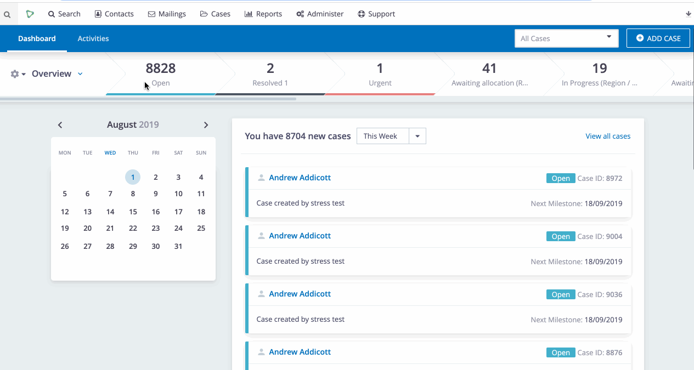

## Manage Cases / 3 column view

The new Manage Cases screen has been redesigned to reduce the amount of “clicking” in and out between cases. Users can easily find other cases
they are working on whilst retaining focus on an existing case.

Tags and other key information about cases is easily visible in the sidebar.

Users can also filter cases by users with various case roles allowing for easier tracking of caseloads and assignment.

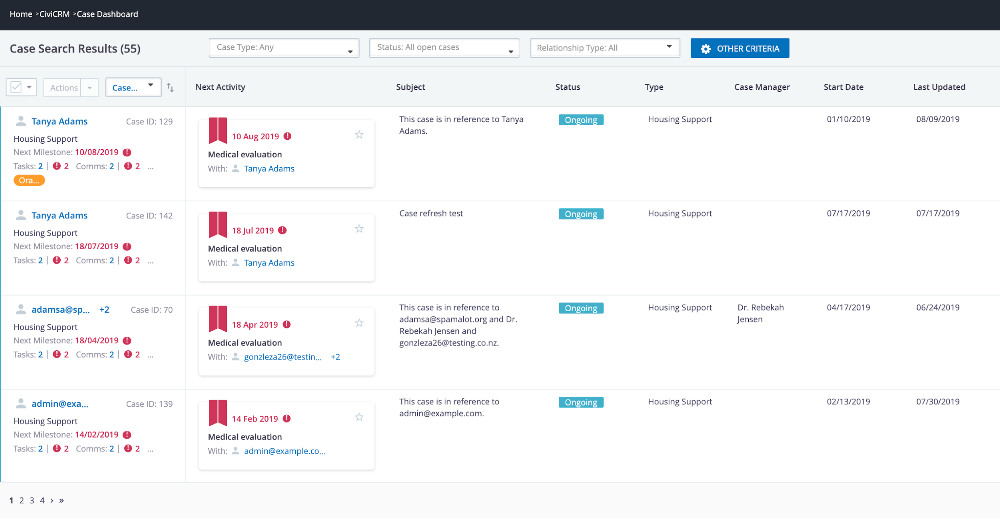

## Upgraded Activities Tab

The activities tab on the case has been redesigned to take its own tab, making management of cases with large numbers of activities far easier.

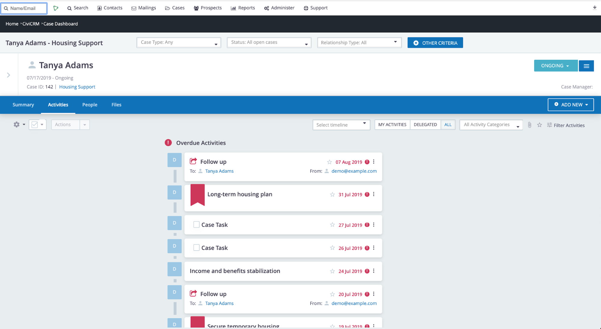

Users can also see an overall view of their activities from all cases allowing them to filter to see a few tasks or actions that they need to perform.

## Activity Categories

Activity Categories are sub-types of Activity type that determines how the activities are displayed to the user. There are 6 main types of activity category:

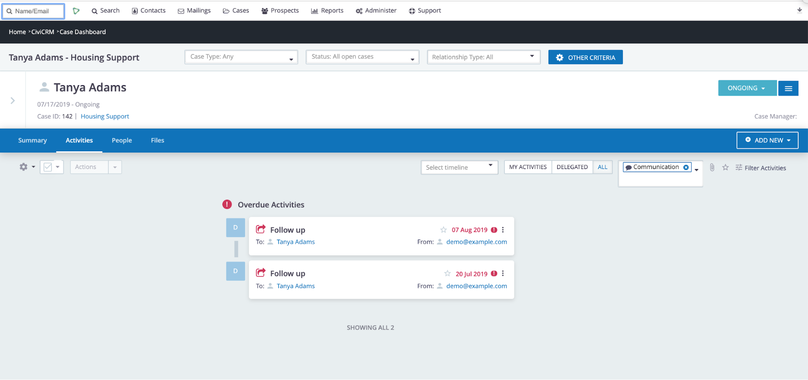

- ### Milestone

Milestones are key activities that need accentuating in your process. It may be a court hearing or a deadline for submission etc. Now they can be displayed as such.
You can easily see how you are doing against key milestones by simply filtering the activities by category = milestone and seeing progress.

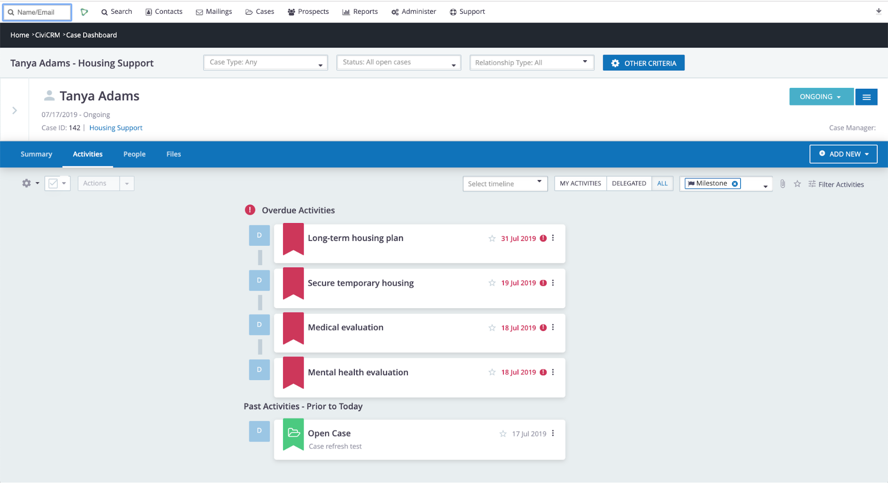

The next milestone is also prominently displayed on the case summary screen:

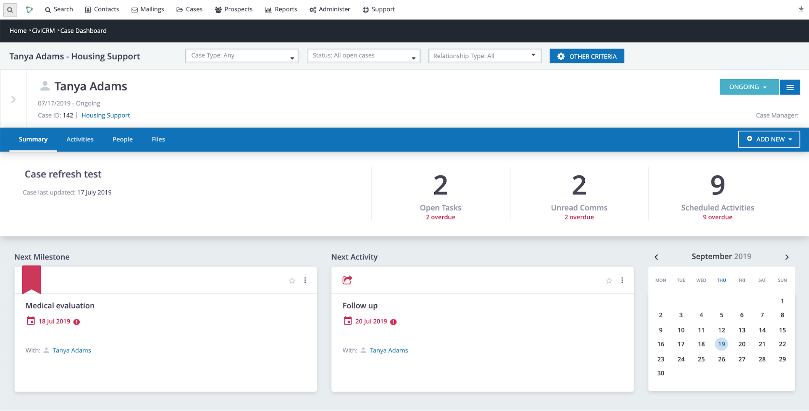

- ### Communication

Outside of milestones there are often large numbers of day to day communication on a case - emails, phone calls, PDF letters. These are displayed showing useful
information of who the communication was from and to.

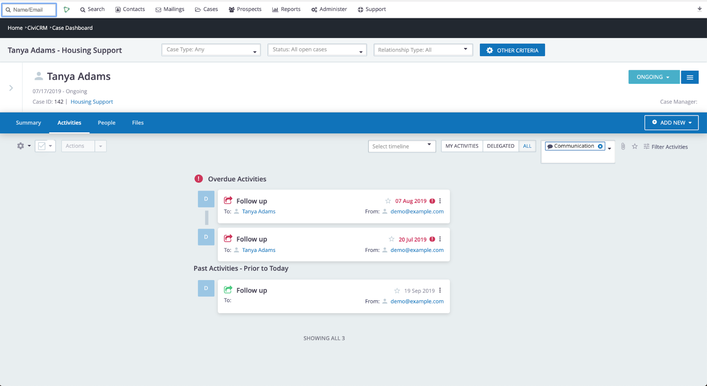

- ### Task

View upcoming tasks from the case summary page. If you’ve completed the task, there’s no need for extensive editing - simply click the checkbox to set activity status to
complete and remove the task from the list.

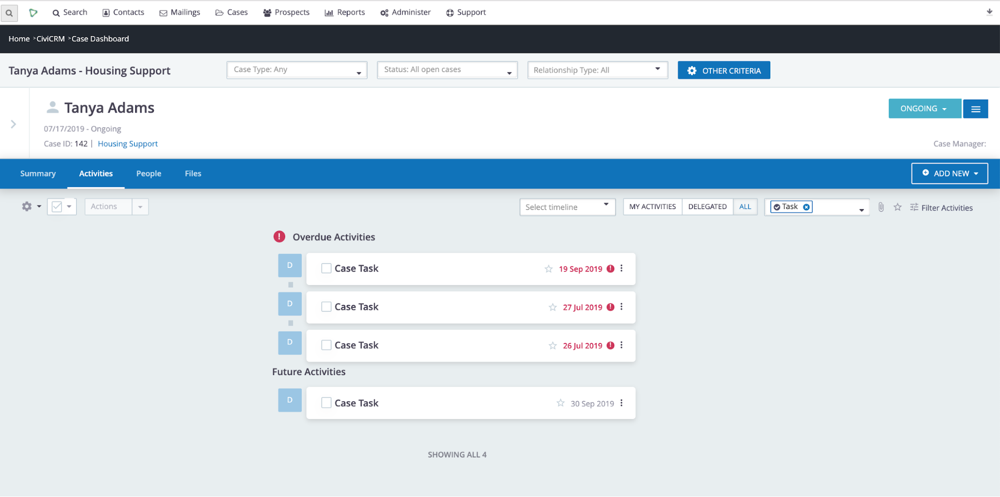

- ### Files

File uploads are now easier to manage. Activities can hold as many files as needed and there is a large drag and drop screen for uploading files with. Files uploaded are
automatically attached to an activity storing the date and time that they are uploaded making tracking easier.

- ### System

We’ve added a System category to group activities generated by the system, like ‘open case’ and ‘case status change’.

## Bulk actions for people involved

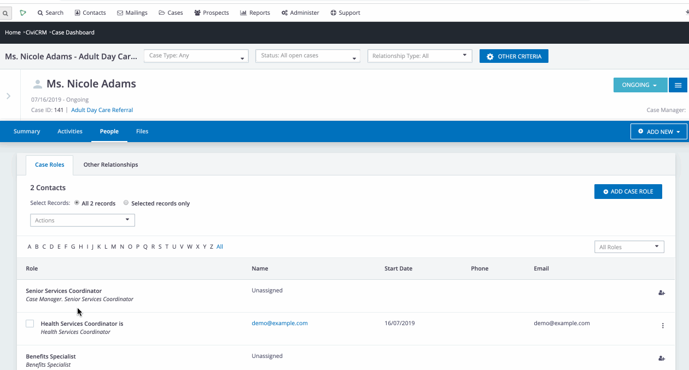

For cases where you may have many case clients or large numbers of people involved, the people involved screen works just like CiviCRM search results. You can filter and also
communicate with them in bulk so mass emails for case clients are easy to prepare.

## Drag and drop file uploads

As mentioned above CiviCRM allows for drag and drop file uploads and automatically attaches them to an activity recording the date that you uploaded them. So if there's a
batch up files, it’s easy to see them all together, and when they were received.

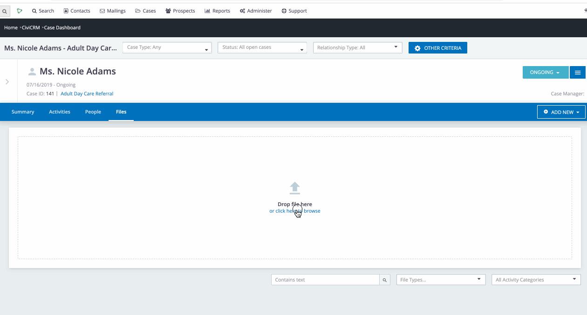

# Other tweaks:

## Communication Draft Save Function

It is now possible to save a draft of any communication that you are creating and return to complete it later.

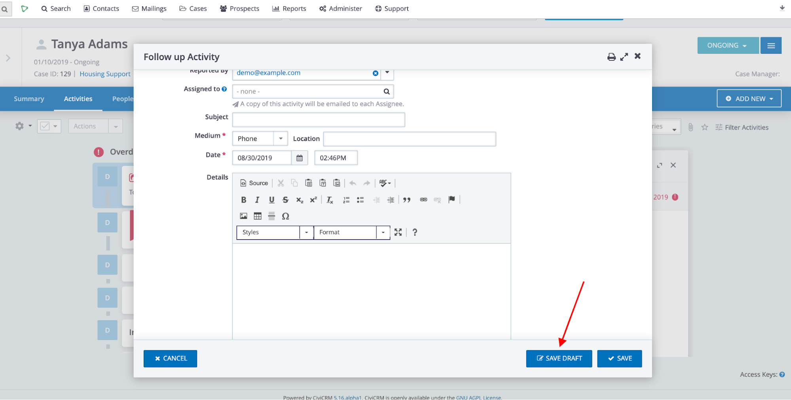

## Extended case tokens

Previously communications could only contain tokens relating to the contact to who the email is being sent. There is a new companion extension to include case tokens for anyone with a role in the case.

As such you can send an email to the case client and now refer to for example the case manager by name.

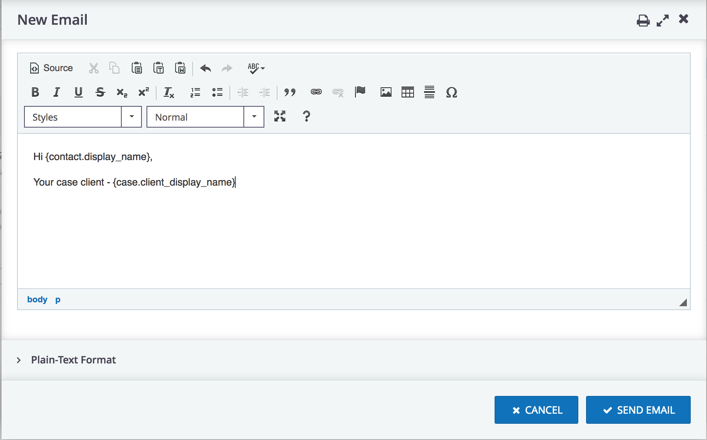

Link to extension: https://github.com/civicrm/org.civicrm.casetokens

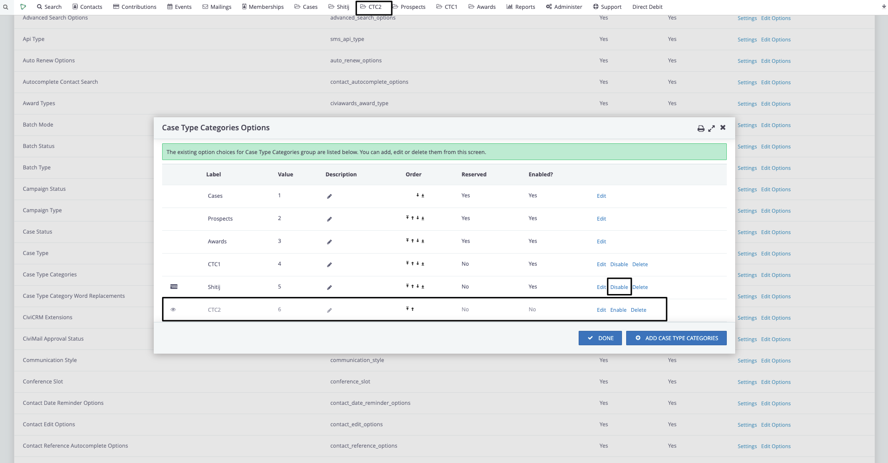

## More

* No need to have “open case” as the first activity on the standard timeline
* Ability to name the standard timeline anything
* Edit inbound email activity subject and other fields (for users with additional permissions)
* Lots of improvements to the CiviCase API
* Activity type icons
* Case status now has a ‘Status class’ field to show cases which are incomplete, completed, or cancelled.

# Technical Requirements
* CiviCRM: version >= v5.8, preferably the latest version.
* [Shoreditch](https://github.com/civicrm/org.civicrm.shoreditch): version >= v0.1-alpha32, preferably the latest version.
* (Recommended) Migrate from embedded activity revisions to full system logging ([CRM-21051](https://issues.civicrm.org/jira/browse/CRM-21051))

# Installation (git/cli)
To install the extension on an existing CiviCRM site:

mkdir sites/all/modules/civicrm/ext
cd sites/all/modules/civicrm/ext
git clone https://github.com/civicrm/org.civicrm.shoreditch shoreditch
git clone https://github.com/compucorp/uk.co.compucorp.civicase civicase
cv en shoreditch civicase

