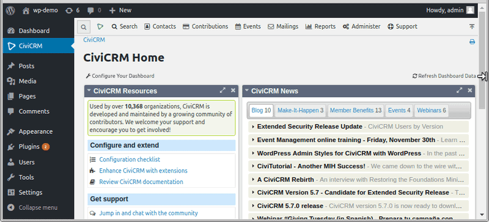

# KAM - Keyboard Accessible Menus

This module uses the SmartMenus jQuery plugin to add a responsive, accessible, configurable menu to CiviCRM.

## Requirements

Requires CiviCRM 5.8 or later.

## Installation

Install as a normal CiviCRM extension; then optionally visit **Administer -> Customize Data & Screens -> Display Preferences** to choose menubar placement.

## Roadmap

This extension will be merged into CiviCRM core in the near future. See https://lab.civicrm.org/dev/core/issues/487

## Configuration

Menubar placement can be configured at **Administer -> Customize Data & Screens -> Display Preferences**. The options control where the menubar appears on desktop screens (on mobile screens it will always be collapsed regardless of this setting).
By default the bar will appear at the top of the screen with a toggle arrow to move it below the CMS menu.

## API

*Provides a clientside api for working with the menubar (adding/removing/updating menu items, etc.)*

#### Events

| Event  | Description | Example |
| ------ | ----------- | ------- |
| `crmLoad` | Triggered on the `#civicrm-menu` element after menu is added to the dom. This is a good time to add/remove items if you already know what they are at page load. | `$(document).on('crmLoad', '#civicrm-menu', function() {`   `  CRM.menubar.addItems(-1, 'Search', myItems);`   `});` | 

#### Properties

| Property | Type | Description |
| ------ | ----------- | ------- |
| `attachTo` | String | jQuery selector of page element to attach menubar to. |
| `position` | String | E.g. 'over-cms-menu', 'below-cms-menu', 'above-crm-container'. |
| `settings` | Object | Settings to pass to SmartMenus during initialize. |

#### Methods

| Method | Description | Example |
| ------ | ----------- | ------- |
| `addItems( position, targetName, items )` | `position`: can be "before" or "after" to create siblings of the target, or an integer to specify index to place as child of the target (negative numbers will start from the end).   `targetName`: name of the menu item to place the new items before/after/within. If using an index for position, specify `null` for placing top-level menu items.   `items`: An array of one or more menu items. | `CRM.menubar.addItems('before', 'Search', [{name: 'foo', label: 'Foo', child: [{name: 'bar', label: 'Bar'}]}]);` |
| `close( )` | Close any open menus. | `CRM.menubar.close();` |
| `destroy( )` | Remove the menubar from the dom (although the menu data is still retained in `CRM.menubar.data` for use by `initialize()`). | `CRM.menubar.destroy();` |
| `hide( [speed], [showMessage] )` | Hides the menubar. `speed`: if a number is given, a slideup animation is used. `showMessage`: if `true`, a restore button will be shown. | `CRM.menubar.hide(250, true);` |
| `obj getItem( itemName )` | Returns the object defining a particular menu item. Includes children. | `CRM.menubar.getItem('New Individual');` |
| `initialize( )` | Build the menu from scratch. Called internally when the page loads. | `CRM.menubar.initialize();` |
| `bool isOpen( itemName )` | Checks if a given menu tree is open (will always return false if called on items that do not have children). | `var isOpen = CRM.menubar.isOpen('Search');` |
| `open( itemName )` | Opens the menu and gives focus to the named item. | `CRM.menubar.open('New Individual');` |
| `removeItem( itemName )` | Deletes an item from the menu (and all its children). `itemName`: name of item to remove. | `CRM.menubar.removeItem('New Household');` |
| `show( [speed] )` | Shows the menubar if hidden. `speed`: if a number is given, a slidedown animation is used. | `CRM.menubar.show(250);` |
| `spin( [spin] )`  | Spins the icon in the home menu. `spin`: pass a boolean to start or stop the spinning, or pass no arguments to toggle. | `CRM.menubar.spin(true); // start`   `CRM.menubar.spin(false); // stop` |
| `togglePosition( [persist] )`  | Toggles between 'over-cms-menu' and 'below-cms-menu'. By default, persist the change to localStorage. | `CRM.menubar.togglePosition();` |
| `updateItem( item )`  | Updates the properties of a menu item (label, url, separator, icon, etc. `item`: object with at least a `name` plus properties to update. | `CRM.menubar.updateItem({name: 'Search', label: 'Find'});` |

Tip: Try pasting those examples into your browser console.

#### CSS classes

*The following css classes are added to the page body*

* `crm-menubar-visible` When the menubar is present and visible.
* `crm-menubar-hidden` When the menubar is present but hidden via `CRM.menubar.hide()`.
* `crm-menubar-wrapped` When the menu items have wrapped to a second line and the menubar is twice as tall.
* Depending on which option is selected, the body will also have one of: `crm-menubar-over-cms-menu`, `crm-menubar-below-cms-menu`, `crm-menubar-above-crm-container`.

#### Hooks

Your custom code can alter the list of menubar placement options via [hook_civicrm_alterSettingsMetaData](https://docs.civicrm.org/dev/en/latest/hooks/hook_civicrm_alterSettingsMetaData/) - modify the `options` array in the setting `menubar_position`.
E.g. adding a new option named "foo" will add class `crm-menubar-foo` to the page body when selected which can be targeted from your stylesheet. 

## Acknowledgements

- The SmartMenus jQuery plugin was written by Vasil Dinkov - smartmenus.org
- Based on com.aghstrategies.slicknav that provides a responsive menu on mobile devices.  This module changes the menu on both mobile and desktop displays.
- Nic Wistreich - customising CSS to blend smartmenus with CiviCRM
